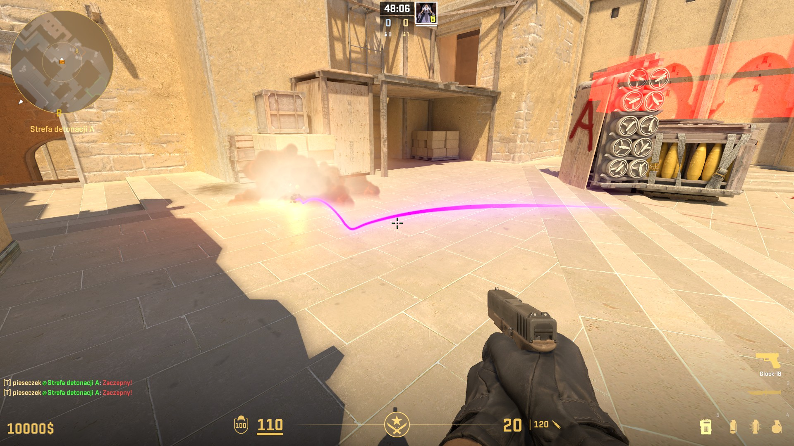

# CS2_GrenadeTrail
> [!CAUTION]
> Plugin is not intended for actual "use".


Plugin that creates a nade trail after HE Grenade is thrown. To use this plugin you need to create special addon with TrailModel which is located in TrailModel/ in this repository. Then change Model path in plugin.<br>
As there are a lot of plugins that create trail effect, I thought about creating a particle based on already existing one made by Valve (particles/ui/hud/ui_map_def_utility_trail.vpcf).<br> This version of that particle allows server owners / developers to change colors via C#. Since there are not many "useful" particles in the game or provided for free (or at least I cannot find anything) that create nice grenade trail effect.<br>Plugin is an **example** how to change colors via C# of particles that use Control Points to manipulate their colors.<br>

<p align="center">
    
</p>

### List of cool trails ingame that I also found:
```
particles/ui/hud/ui_map_def_utility_trail.vpcf - original one
particles/weapons/cs_weapon_fx/bumpmine_active.vpcf_c
particles/water_fx/waterfall_base.vpcf
particles/money_fx/moneybag_trail.vpcf_c
```

I would like to thanks my Mom, Dad, my cat and most importantly guys from CSS discord who helped me to figure this out:
- Exkludera,
- Prefix,
- KeePassXC
